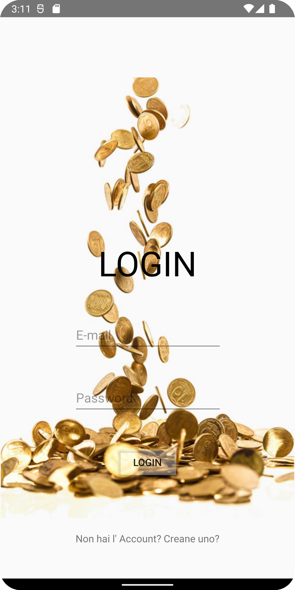
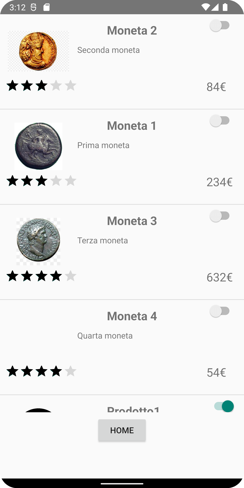
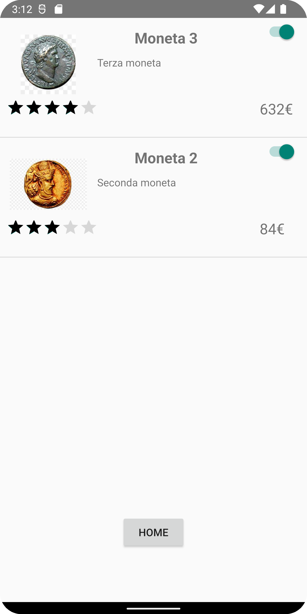
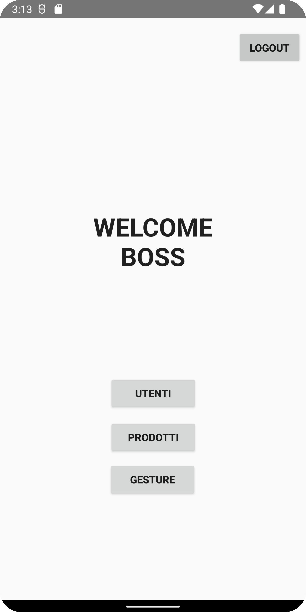
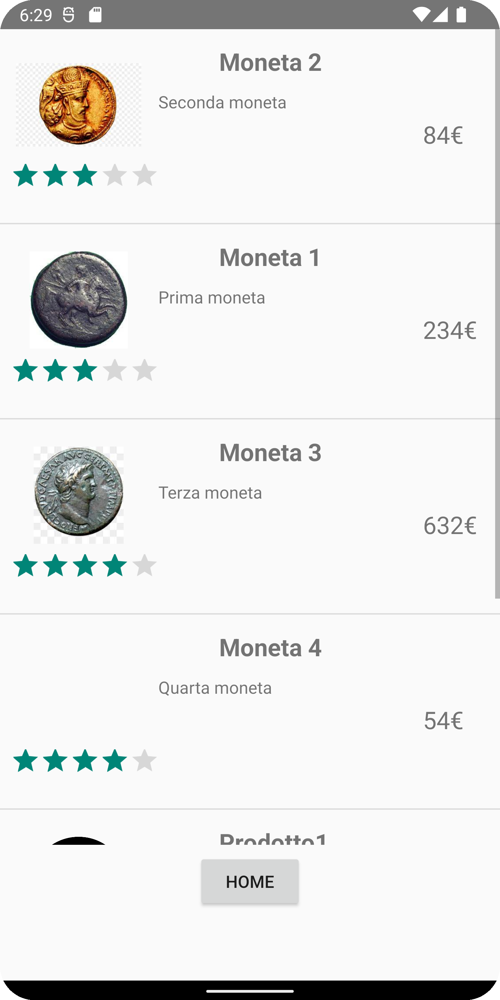
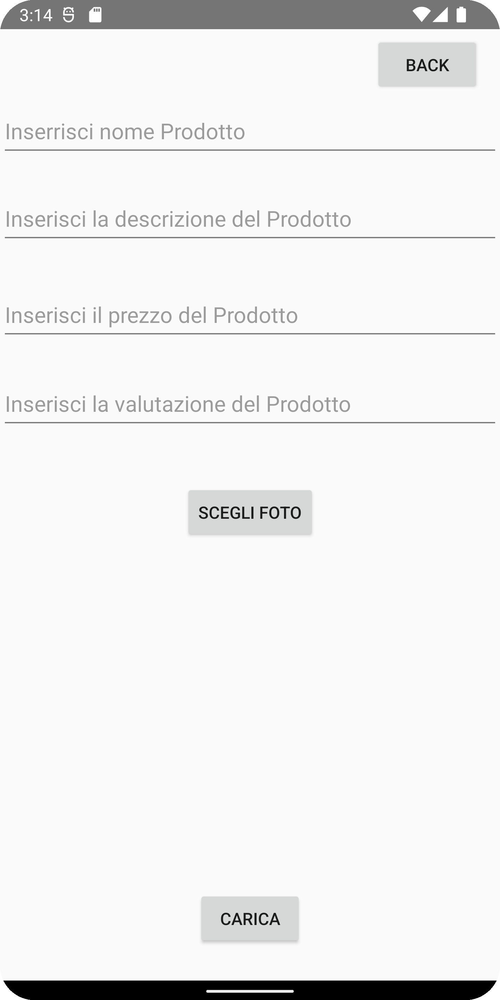
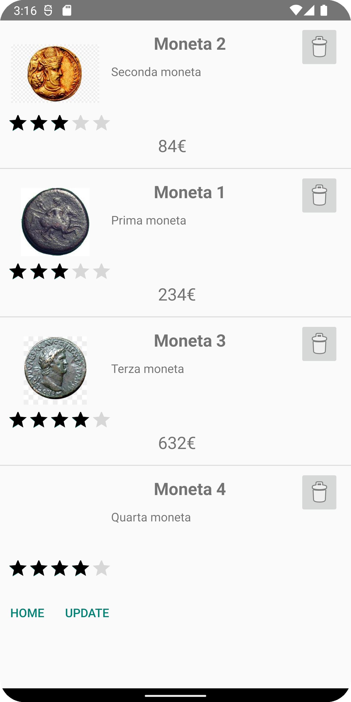

# Progetto-Mobile
Applicazione Mobile, in Android Studio che simula il funzionamento di un'applicazione per la vendita di monete online.

In questa applicazione sono state realizzate le seguenti Activity.

## Registrazione

## Login

## Home utente

## Lista Prodotti utente

## Lista desideri 

## Home Admin

## Lista prodotti Admin

## Lista utenti

## Gesture

## Aggiunta e modifica prodotti

## Rimozione prodotti

